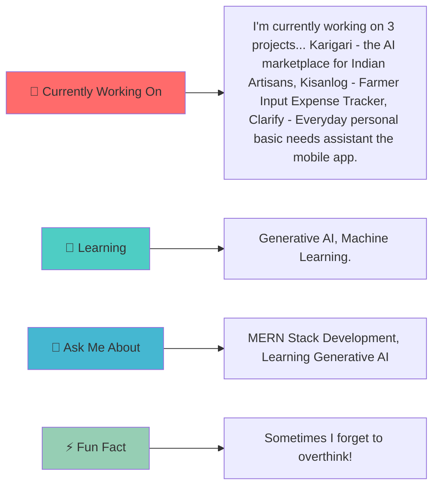

<div align="center">
  
  <!-- Animated Header -->
  
  
  <!-- Typing Animation -->
  
  
</div>

---

<div align="center">

## 🎯 WHO AM I?

<table>
<tr>
<td>

</td>
<td>

```yaml
name: Adinath Deepak Jadhav
located_in: Kolhapur, India
current_role: Student
education: [B. Tech 3rd Year Data Science.]
website: https://portfolio2-flame-psi.vercel.app/

currently_learning: Generative AI, Machine Learning.
2024_goal: As the Developer I want to contribute to open-source and learning about it, and make the projects that would really help ones to make a productive life.
hobbies: Reading Books, Listening songs, Self-Improvement, gaming.
```

</td>
</tr>
</table>

</div>

---

<div align="center">

## 🚀 TECH STACK & TOOLS


<br/><br/>

<!-- Programming Languages -->
 **Languages I Speak:**


</div>

---

<div align="center">

## 📊 GITHUB ANALYTICS


<br/>


</div>

---

<div align="center">

## 🏆 ACHIEVEMENTS & TROPHIES


</div>

---

<div align="center">

## 💼 FEATURED PROJECTS

<table>
<tr>
<td width="50%">


### 🎨 Karigari - the AI marketplace for Indian Artisans

[Your projectDescription1]

**Tech Stack:** `React, Node, Express, Mongodb, Generative AI`

[]([Your projectLink1])
[]([Your projectRepo1])

</td>
<td width="50%">


### 🚀 Kisanlog - Farmer Input Expense Tracker

[Your projectDescription2]

**Tech Stack:** `Currently HTML, CSS, JS, Node.js, MongoDB`

[]([Your projectLink2])
[]([Your projectRepo2])

</td>
</tr>
<tr>
<td width="50%">


### 🔥 Clarify - Everyday personal basic needs assistant the mobile app.

[Your projectDescription3]

**Tech Stack:** `React-Native, Stylesheet`

[]([Your projectLink3])
[]([Your projectRepo3])

</td>
<td width="50%">


### ⚡ [Your projectName4]

[Your projectDescription4]

**Tech Stack:** `[Your projectStack4]`

[]([Your projectLink4])
[]([Your projectRepo4])

</td>
</tr>
</table>

</div>

---

<div align="center">

## 🎯 CURRENT FOCUS




</div>

---

<div align="center">

## 📈 CONTRIBUTION GRAPH


</div>

---

<div align="center">

## 🌐 CONNECT WITH ME


[](https://portfolio2-flame-psi.vercel.app/)
[](https://linkedin.com/in/[adinath-jadhav])
[](mailto:adinath0632@gmail.com)

### 💬 Let's Talk About:
- 🔥 Web Development & Modern Frameworks
- 🤖 AI/ML & Data Science
- 🎨 UI/UX Design Principles
- 🚀 Startup Ideas & Innovation
- 📚 Tech Books & Learning Resources

</div>

---

<div align="center">

## 📊 WEEKLY DEVELOPMENT BREAKDOWN

<!--START_SECTION:waka-->
<!--END_SECTION:waka-->

</div>

---

<div align="center">

## 🎵 SPOTIFY PLAYING

[](https://spotify-github-profile.vercel.app/api/spotify-playing)

</div>

---

<div align="center">


### Thanks for visiting! Have a great day! ✨


</div>