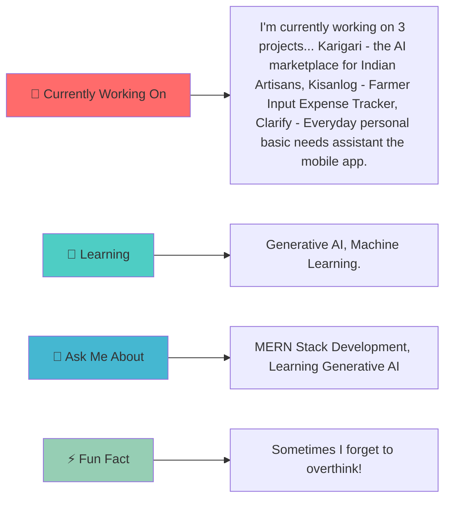

<div align="center">

  <!-- Animated Header -->
  

  <!-- Typing Animation -->
  <picture>
    
  </picture>

</div>

---

<div align="center">

## 🎯 WHO AM I?

<table>
<tr>
<td>

</td>
<td>

```yaml
name: Adinath Deepak Jadhav
located_in: Kolhapur, India
current_role: Student
education: B. Tech 3rd Year Data Science.
website: https://portfolio2-flame-psi.vercel.app/

currently_learning: Generative AI, Machine Learning.
2024_goal: As the Developer I want to contribute to open-sourc and make the projects that would really help ones to make a productive life.
hobbies: Reading Books, Listening songs, Self-Improvement, gaming.
```

</td>
</tr>
</table>

</div>

---

<div align="center">

## 🚀 TECH STACK & TOOLS


<br/>

**Additional Tools:** Mongoose • React Native • Framer • NumPy • Machine Learning

<br/><br/>

<!-- Programming Languages -->
 **Languages I Speak:**


<br/>


</div>

---

<div align="center">

## 📊 GITHUB ANALYTICS


<br/>


</div>

---

<div align="center">

## 🏆 ACHIEVEMENTS & TROPHIES


</div>

---

<div align="center">

## 💼 FEATURED PROJECTS

<table>
<tr>
<td width="50%">


### 🎨 Karigari - AI Marketplace for Indian Artisans

An innovative marketplace platform connecting artisans with customers using AI recommendations.

**Tech Stack:** `React, Node, Express, MongoDB, Generative AI`

[](https://github.com/Adinath-j/Karigari)

</td>
<td width="50%">


### 🚀 Kisanlog - Farmer Expense Tracker

A full-stack MERN application helping farmers log, track, and analyze agricultural expenses.

**Tech Stack:** `React, Node.js, Express, MongoDB`

[](https://kisanlogwbackend.onrender.com/)
[](https://github.com/Adinath-j/Kisanlog)

</td>
</tr>
<tr>
<td width="50%">


### 🔥 Clarify - Personal Assistant Mobile App

An everyday personal assistant app for basic needs with intuitive UI and helpful features.

**Tech Stack:** `React Native, Stylesheet`

[](https://github.com/Adinath-j/Clarify)

</td>
<td width="50%">


### 🌐 Personal Portfolio

A modern developer portfolio showcasing my skills, projects, and achievements with smooth animations.

**Tech Stack:** `React, Tailwind CSS, Vercel`

[](https://portfolio2-flame-psi.vercel.app/)
[](https://github.com/Adinath-j/portfolio2)

</td>
</tr>
</table>

</div>

---

<div align="center">

## 🎯 CURRENT FOCUS




</div>

---

<div align="center">

## 📈 CONTRIBUTION GRAPH


</div>

---

<div align="center">

## 🌐 CONNECT WITH ME


[](https://portfolio2-flame-psi.vercel.app/)
[](https://linkedin.com/in/adinath-jadhav)
[](mailto:adinath0632@gmail.com)

### 💬 Let's Talk About:
- 🔥 Web Development & Modern Frameworks
- 🤖 AI/ML & Data Science
- 🎨 UI/UX Design Principles
- 🚀 Startup Ideas & Innovation
- 📚 Tech Books & Learning Resources

</div>

---

<div align="center">

## 📋 RECENT ACTIVITY

<!--START_SECTION:activity-->
<!--END_SECTION:activity-->

</div>

---

<div align="center">

## 📊 WEEKLY DEVELOPMENT BREAKDOWN

<!--START_SECTION:waka-->
<!--END_SECTION:waka-->

</div>

---

<div align="center">

## 💻 RECENTLY WORKED ON

```yaml
Projects:
  - 🎨 Karigari: AI marketplace connecting artisans with customers
  - 🚀 Kisanlog: Full-stack MERN farmer expense tracker
  - 💬 Clarify: Personal assistant mobile application

Learning:
  - 🤖 Generative AI & LLMs
  - 📊 Machine Learning
```

</div>

---

<div align="center">


### Thanks for visiting! Have a great day! ✨


</div>
